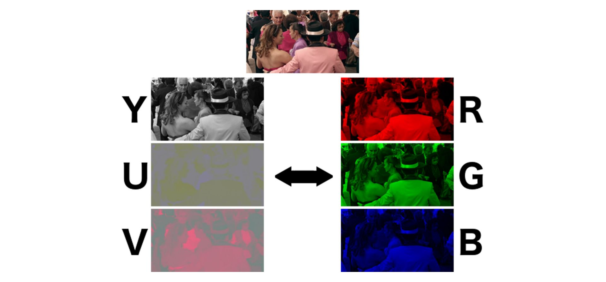

# Exploration of Comparison between Spiking Neural Networks on RGB and YUV Data
Repository for exploring color space difference for performance for Spiking Neural Network. Most relevantly YUV and RGB.

# Introduction

In the quest for developing more effective and efficient artificial neural networks, Spiking Neural Networks (SNNs) have emerged as a promising approach due to their ability to emulate the dynamic nature of biological neurons, thereby enabling more powerful and energy-efficient computations.

The objective of this project is to dive into an exploration and comparison of the performance of SNNs on RGB and YUV color spaces. Color spaces play a critical role in image processing tasks, particularly in defining how colors are represented within an image.
# Motivation
## Role of Color Spaces

Understanding the role of RGB and YUV color spaces is vital for this study.
### RGB Color Space

The RGB color model is an additive color model in which the red, green, and blue primary colors of light are added together in various ways to reproduce a broad array of colors. This model closely matches the way human sight develops color, and thus, it is widely used in many devices that capture or display images.
### YUV Color Space

YUV is a color encoding system typically used as part of a color image pipeline. It encodes a color image or video taking human perception into account, allowing reduced bandwidth for chrominance compared to luminance data, as humans are more sensitive to changes in brightness than color. Y channel corresponds to the luminance (or brightness) and U and V to the chrominance (or color).

## Relation to Retinal Ganglion Cells

The design of the YUV color space reflects the workings of the human visual system, similar to the way our [retinal ganglion cells](https://en.wikipedia.org/wiki/Retinal_ganglion_cell) process visual information. They send color and brightness information separately, with more emphasis on the brightness information – an aspect that's essentially replicated in the YUV model. This human vision-related feature gives the YUV color space an edge, particularly when we aim for more biologically plausible models like SNNs.

There are about 0.7 to 1.5 million retinal ganglion cells in the human retina. With about 4.6 million cone cells and 92 million rod cells, or 96.6 million photoreceptors per retina, on average each retinal ganglion cell receives inputs from about 100 rods and cones.

This information can be used when trying to build an SNN to mimic the function of the retina. With more rods than cones, the Y (Luminance) channel should have more attention in the network.
## Relevance to Spiking Neural Networks (SNNs)

SNNs, also referred to as the "third generation" of neural networks, are closer to biological networks compared to their predecessors. They do not just process neuronal signals but also take into account the 'time' factor, i.e., the precise moment when a neuron fires.

Given the temporal dynamics of SNNs and the separate luminance-chrominance data handling in the YUV space, we hypothesize that SNNs may show different performance patterns when trained on RGB data compared to YUV data.
#  Project Aims

This exploration project aims to:

  Develop SNN models and train them on image datasets in both RGB and YUV color spaces.
  Compare and contrast the performance of these SNNs.
  Understand the effects of color space transformations on SNNs' performance and efficiency.
  Identify if YUV data could potentially leverage SNNs' architecture to yield better results in terms of computational efficiency and performance accuracy.

# Conclusion

Through this project, we expect to gain insights that will enhance the understanding and effectiveness of SNNs. Given the biological plausibility of both SNNs and the YUV color space, this exploration could potentially lead to the development of more efficient, effective, and biologically relevant artificial neural networks.

We invite contributions and collaborations to this open exploration. Feel free to fork the repository, submit issues, and propose pull requests. Let's embark on this journey to delve deeper into the realm of SNNs and color spaces.
